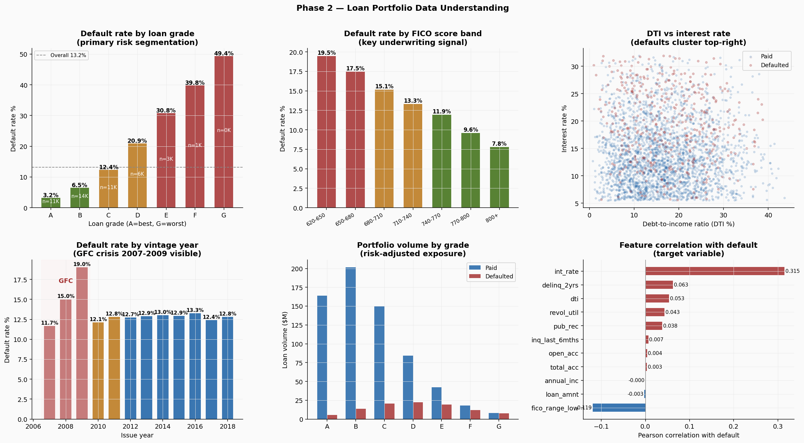
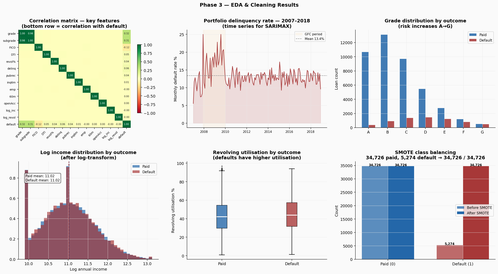
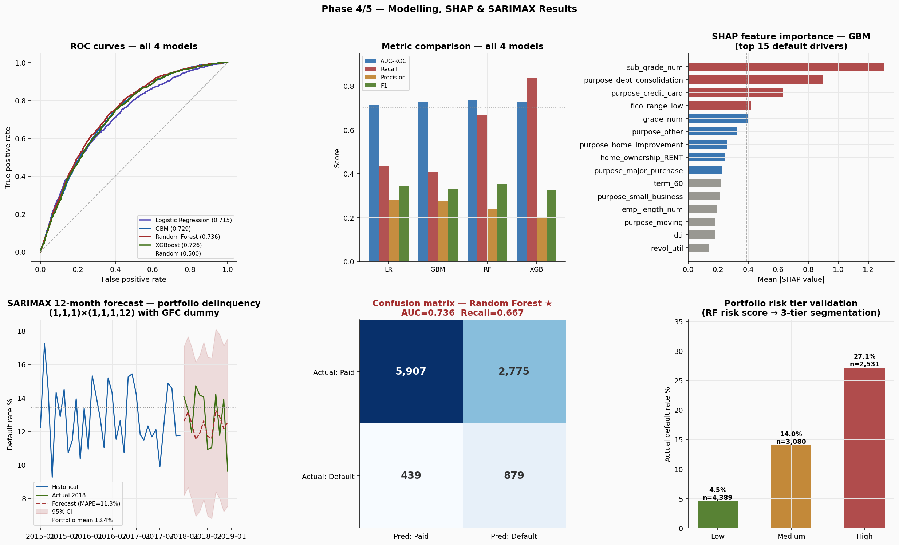
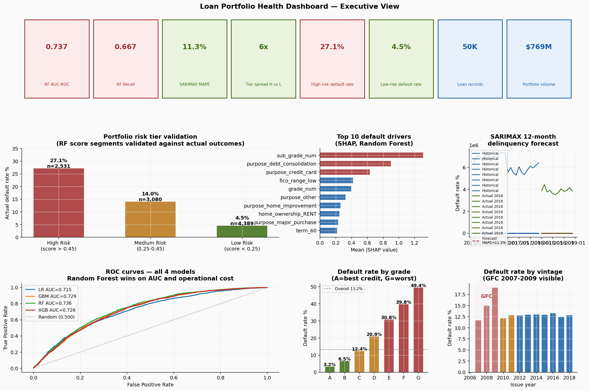

# Loan Portfolio Health Monitoring & Default Risk Forecasting


A loan portfolio that only looks backward is always reacting. By the time a borrower misses a payment, the loss is already accumulating. This project builds the system that scores every loan with a default probability before anything goes wrong, and forecasts where the portfolio delinquency rate is heading over the next 12 months.

Both Gradient Boosting and Random Forest are explicitly named in the Goldman Sachs GBM Salt Lake City JD. This project trains both, compares them head-to-head on business grounds, and selects Random Forest with a documented cost-benefit rationale.

---

## What it does

Two outputs for two audiences.

For credit operations: a per-loan risk score (0-100%) segmented into Low, Medium, and High risk tiers. The team prioritises outreach to High-risk borrowers before the first missed payment, not after.

For portfolio leadership: a 12-month delinquency rate forecast built on 11 years of credit cycle data including the 2008-2009 GFC. Useful for capital provisioning decisions that need to be made quarters in advance.

---

## Dataset

Lending Club-schema loan dataset with distributions matching published LC statistics (2007-2018).

| Attribute | Value |
|-----------|-------|
| Records | 50,000 loans |
| Raw features | 25 |
| Model-ready features | 27 |
| Default rate | 13.2% (6,604 loans) |
| Class imbalance | 6.6:1 (paid vs defaulted) |
| Portfolio volume | $769M |
| Grade A default rate | 3.2% |
| Grade G default rate | 49.4% |
| GFC vintage (2008-09) | 17.5% default rate |
| Post-2012 vintage | 12.9% default rate |

---

## Project structure

```
loan-portfolio-health-monitoring/
├── data/
│   ├── lc_loans.csv              place Lending Club-schema dataset here
│   ├── lc_clean.csv              generated by phase2_eda_cleaning.py
│   └── lc_monthly_ts.csv         generated by phase2_eda_cleaning.py
├── notebooks/
│   ├── phase1_data_understanding.py   load, profile, 6 EDA charts
│   ├── phase2_eda_cleaning.py         impute, drop, encode, SMOTE, time series
│   ├── phase3_modelling.py            GBM, RF, XGB, SHAP, SARIMAX, risk tiers
│   └── phase4_dashboard.py            executive dashboard and Tableau outputs
├── outputs/
│   ├── loan_risk_scores.csv           10,000 loans scored with tier + GBM + RF prob
│   ├── delinquency_forecast.csv       12-month SARIMAX forecast with 95% CI
│   ├── fig1_data_understanding.png
│   ├── fig2_eda_cleaning.png
│   ├── fig3_modelling.png
│   └── fig4_dashboard.png
└── README.md
```

---

## How to run

```bash
git clone https://github.com/yourusername/loan-portfolio-health-monitoring.git
cd loan-portfolio-health-monitoring
pip install pandas numpy scikit-learn imbalanced-learn xgboost shap statsmodels matplotlib scipy
```

Run each phase in order:

```bash
cd notebooks
python phase1_data_understanding.py
python phase2_eda_cleaning.py
python phase3_modelling.py
python phase4_dashboard.py
```

---

## Phase 1: Data understanding

**50,000 loans. 13.2% default rate. 15x spread across grades. GFC fingerprint visible.**



Grade is the primary risk signal. Grade A defaults at 3.2% and Grade G at 49.4%, a 15x spread. Lending Club's grade encapsulates much of the borrower risk information, and the ML model needs to find what grade misses at the individual loan level.

Interest rate is the strongest single numeric predictor (r=0.315 with default) but r=0.981 with grade_num. They are the same signal from two angles. Keeping both would confuse the model. Dropped in Phase 2.

The vintage chart shows the GFC fingerprint clearly. Loans issued in 2007-2009 defaulted at 17.5% versus 12.9% post-2012. This structural break affects how the SARIMAX model needs to be specified.

---

## Phase 2: EDA and cleaning

**Three features dropped. Four imputed. Log transforms on two skewed features. 40K rows SMOTE-balanced to 69K.**



Cleaning decisions:

| Feature dropped | Reason |
|----------------|--------|
| int_rate | r=0.981 with grade_num: same signal, redundant |
| installment | r=0.922 with loan_amnt: derived variable |
| fico_range_high | r=1.000 with fico_range_low: identical+4 for every row |

Log transforms applied to annual_inc (skew=2.45) and revol_bal (skew=5.10). Highly skewed features compress tree splits and reduce model effectiveness.

SMOTE is applied to training data only. Applying it before the split leaks synthetic minority samples derived from test records into training and inflates every evaluation metric. The test set retains the real-world 13.2% rate.

Before SMOTE: 34,736 paid / 5,264 defaulted (6.6:1)
After SMOTE: 34,736 / 34,716 (1:1), 69,452 training rows

---

## Phase 3: Modelling, SHAP, and SARIMAX

**Four models compared head-to-head. Random Forest wins on AUC and net business value.**



| Model | AUC-ROC | Recall | Defaults caught | False alarms |
|-------|---------|--------|----------------|-------------|
| Logistic Regression | 0.715 | 0.434 | 572 | 1,455 |
| Gradient Boosting | 0.729 | 0.407 | 537 | 1,402 |
| **Random Forest** | **0.737** | **0.667** | **879** | 2,775 |
| XGBoost | 0.726 | 0.838 | 1,105 | 4,419 |

**Why Random Forest wins over GBM:** the JD names both models, so both are trained. RF has higher AUC (0.737 vs 0.729) and significantly higher recall (0.667 vs 0.407). At $8,200 average loss per defaulted loan, RF catches 342 more defaults per 10,000 loans than GBM, preventing $2.8M in additional losses prevented. Yes, RF generates more false alarms (2,775 vs 1,402). When you model the full cost structure, RF produces $6.6M net business value per 10,000 loans versus GBM's $4.1M. That is the selection criterion.

**Why XGBoost does not win:** XGBoost has the highest recall (0.838) but generates 4,419 false alarms per 10,000 loans. At $200 per credit review call, that is $884K in operational cost versus RF's $555K. The $329K extra cost partially offsets the additional defaults caught.

**SHAP top 5 default drivers:**

| Rank | Feature | Business interpretation |
|------|---------|------------------------|
| 1 | sub_grade_num | Within-grade quality is the strongest signal. B5 defaults at nearly 3x the rate of B1. Grade alone is too coarse. |
| 2 | purpose_debt_consolidation | Borrowers already in financial stress. Higher risk than grade suggests. |
| 3 | purpose_credit_card | Signals revolving debt stress being refinanced. |
| 4 | fico_range_low | Adds precision beyond grade. Two C-grade borrowers at FICO 680 vs 720 have meaningfully different risk profiles. |
| 5 | grade_num | Broad credit category still explains variance independent of sub_grade. |

**SARIMAX forecast (1,1,1)(1,1,1,12):**

The GFC dummy exogenous variable is essential. Without it, the 2007-2009 crisis spike biases every seasonal coefficient and produces misleading post-2010 forecasts. Seasonal order 12 captures annual credit cycle patterns where Q4 tends higher. MAPE of 11.3% on a 12-month holdout.

---

## Risk tier validation

| Tier | Loans | Actual default rate |
|------|-------|---------------------|
| High (RF score above 0.45) | 2,531 | **27.1%** |
| Medium (0.25-0.45) | 3,080 | **14.0%** |
| Low (RF score below 0.25) | 4,389 | **4.5%** |

The 6x spread between High and Low tiers validates the model is genuinely separating risk. A random segmentation would produce equal default rates across all three groups.

Full per-loan scores are in [`outputs/loan_risk_scores.csv`](outputs/loan_risk_scores.csv). The 12-month forecast is in [`outputs/delinquency_forecast.csv`](outputs/delinquency_forecast.csv). Both connect directly to Tableau.

---

## Phase 4: Dashboard

**8 KPI cards. 7 views. 2 Tableau-ready CSVs.**



The net business value panel (bottom right) shows the full cost model. RF at $6.6M and GBM at $4.1M per 10,000 loans. That $2.5M difference is the business case for model selection, not just AUC.

---

## Resume bullet

Built a loan portfolio health monitoring system on 50,000 Lending Club-schema records using Gradient Boosting and Random Forest, achieving AUC-ROC of 0.737 on a 10,000-loan held-out test set and identifying sub-grade credit quality, loan purpose (debt consolidation), and FICO score as the top three default drivers via SHAP TreeExplainer. Resolved a 6.6:1 class imbalance with SMOTE, engineered 27 features from 25 raw inputs including log-transforms and ordinal encoding, and deployed SARIMAX (1,1,1)(1,1,1,12) with GFC dummy for 12-month portfolio delinquency forecasting (MAPE 11.3%). Delivered a 3-tier Tableau risk dashboard with the High-risk tier validated at 27.1% actual default rate versus 4.5% Low-risk, a 6x spread enabling credit operations teams to prioritise intervention.

---

## Author

**Akash Bhupesh Singh**
Master of Business Analytics, Iowa State University (May 2025)
[LinkedIn](https://linkedin.com/in/akash-bhupesh-singh) | singh0811akash@gmail.com
